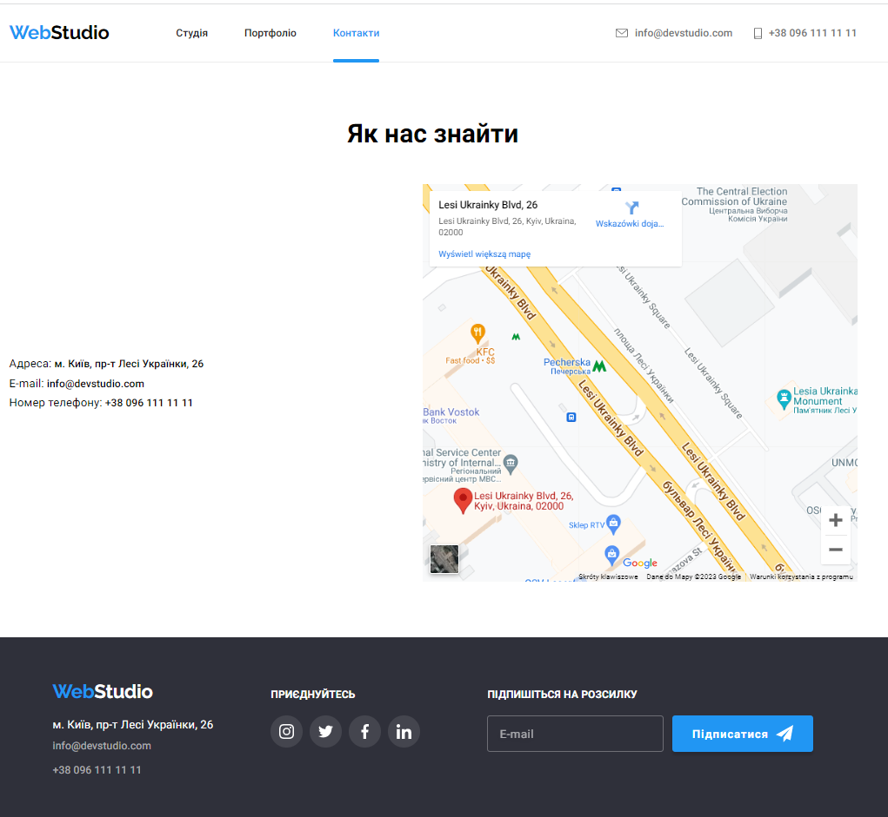

# Web Studio Site

WebStudio site to show my skills in Frontend development for SoftRyzen company.

**Vercel deployment**:(https://web-studio-next.vercel.app/)

There is a 4 pages on this site:

- [Studio page](https://web-studio-next.vercel.app/), where you can leave your contact information by clicking on "Замовити послугу" via modal form.
- [Portfolio page](https://web-studio-next.vercel.app/portfolio), where located developed projects. You can filter them by clicking on group buttons located on top.
- [Contacts page](https://web-studio-next.vercel.app/contacts), where you can find contact information and check adress on map with [Google maps](https://maps.google.com/).
- [Error Page](https://web-studio-next.vercel.app/12). Standard 404 page on wrong routes. Redirecting to Studio page in 3 seconds.

## Demo

Studio Page

Portfolio Page

Contacts Page

## Tech Stack

**Client:** NextJS, SASS, react-aos, body-scroll-lock

## Features

- Adaptive design (phone, tablet, desktop)
- Live previews
- Animations on desktop version

## Support

Feel free to contact with me via Telegram (@serejque) for support.
